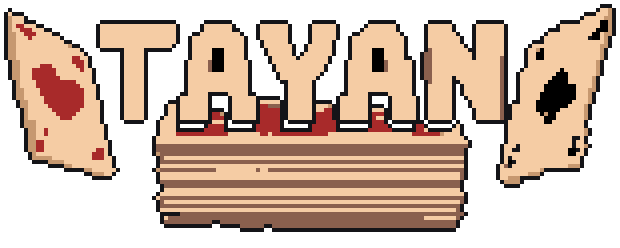
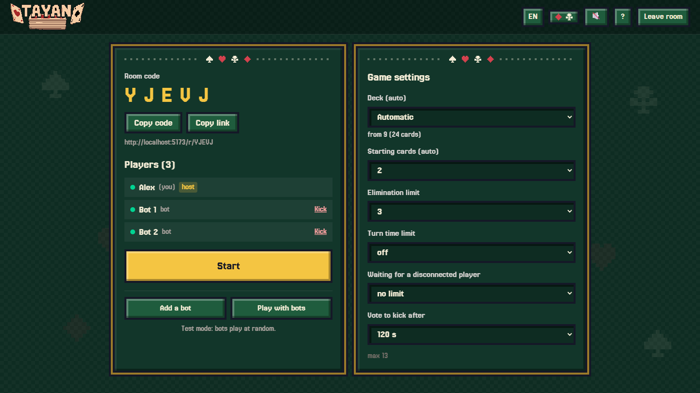
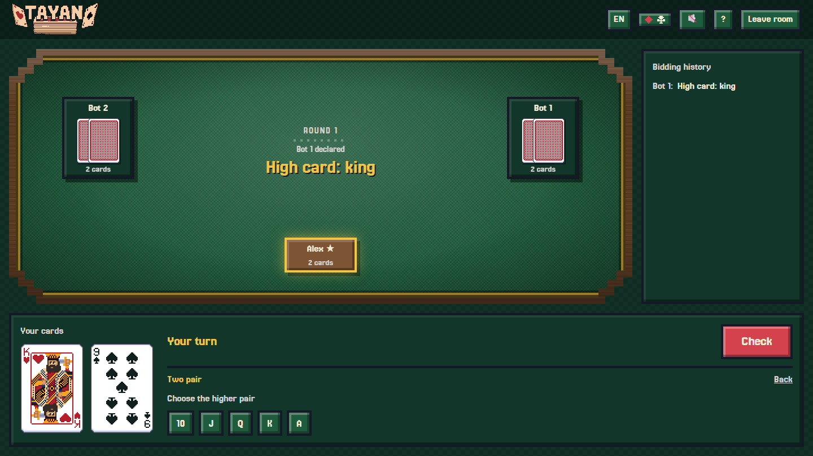
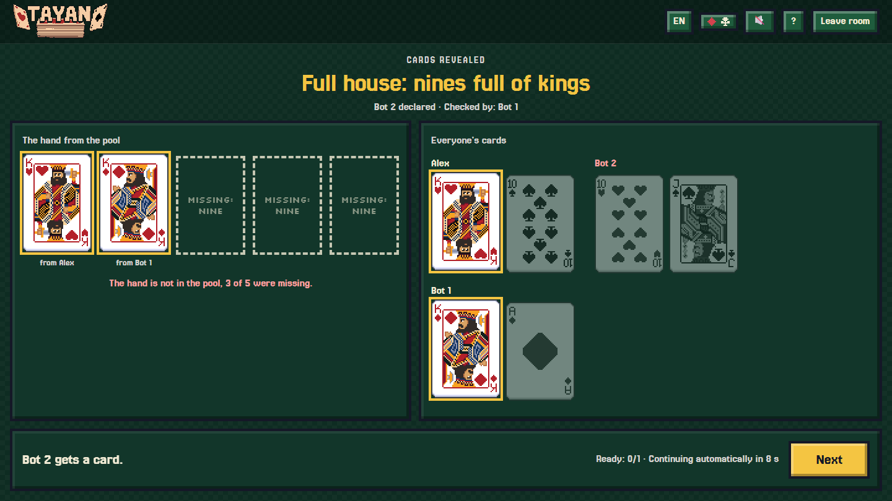

> This is a game my friends and I played a ton back in school and university. It surely exists somewhere under another name, and probably with slightly different rules, but I don't care :). Once we all grew up it got much harder to get everyone in one room, so I vibe-coded an online version. Enjoy!

  

  <b>Bluff, bid poker hands and call out your opponents.</b> 
  A card game for 2 to 13 players, right in your browser. No accounts, nothing to install. Works on a computer, a tablet and a phone (sideways is the most comfortable).

  <a href="https://tayan.pages.dev"><b>▶ Play now</b></a>
  &nbsp;·&nbsp;
  <a href="README.pl.md">Polski</a>

  

## What it is

Everyone gets a few cards and sees only their own. On your turn you either **announce a poker hand** you believe can be built from all the cards on the table together, or you **call** the player before you. Holding a pair of queens? Or just pretending? That is up to you.

Rounds are short and the tension grows with every card the loser has to take. The last player standing wins.

## Getting started

1. Open **[tayan.pages.dev](https://tayan.pages.dev)**, type a nickname and click **Create room**.
2. Send your friends the **room code** or the link. They just open it and enter a nickname.
3. When everyone is in, click **Start**. Nobody to play with? Add **bots** in the lobby and try the rules out.

  

## How to play

1. **The deal.** Everyone starts with 2 cards (1 with many players). You only see your own.
2. **Bidding.** The first player announces any hand, for example "a pair of queens". The next player must do one of two things:
   - **raise**: announce a hand that is _higher_ than the previous one, or
   - **call**: decide the previous player is bluffing.

   There is no passing. If someone announces the highest possible hand, the next player can only call.

3. **The call.** Everyone turns their cards over and we see whether the announced hand can be built from **all the players' cards together**. It does not have to be in the announcer's own hand!
   - The hand **is there**: whoever called takes a card.
   - The hand **is not there**: whoever announced it takes a card.
4. **Next round.** The loser now holds one more card and the cards are reshuffled. Anyone who reaches the limit (**6 cards** by default) is out. The last player in the game wins.

  

### Hands from lowest to highest

|     | Hand            | Example                                 |
| --- | --------------- | --------------------------------------- |
| 1   | High card       | a jack                                  |
| 2   | Pair            | two queens                              |
| 3   | Two pairs       | kings and nines                         |
| 4   | Straight        | five consecutive ranks, e.g. 6-7-8-9-10 |
| 5   | Three of a kind | three aces                              |
| 6   | Flush           | five spades                             |
| 7   | Full house      | three kings and two nines               |
| 8   | Four of a kind  | four jacks                              |
| 9   | Straight flush  | a straight in one suit                  |

Note: a **straight ranks below three of a kind**, unlike in classic poker, because with the cards of many players a straight turns up much more easily. You can open the in-game help at any time (the **?** button or the **H** key).

### The reveal

After a call you see exactly where the hand came from and what was missing. The cards turn over one by one and it is clear who takes the extra card. It is the best moment to draw conclusions before the next round.

  

## A few tips

- **Do not be afraid to bluff.** Your announcement does not have to rest on your own cards, the whole pool counts.
- **Count the cards you cannot see.** The more cards in play, the easier a pair, three of a kind or a straight is to find, so announce high hands carefully.
- **Watch your opponents.** Who always raises, and who calls quickly? Remember it for the next round.

## Room settings

In the lobby the host can change the number of starting cards, the elimination limit, the turn time limit, the deck and how long the game waits for a disconnected player. Players who lose their connection rejoin by refreshing the page and get the same cards back.

## For developers

Running locally, architecture and deployment: [docs/development.md](docs/development.md). The full rules specification (in Polish): [docs/spec.md](docs/spec.md).

Card art: [Pixel Art Playing Cards](https://kerenel.itch.io/pixelart-cards) by Kerenel (CC0). More in [docs/assets.md](docs/assets.md).
