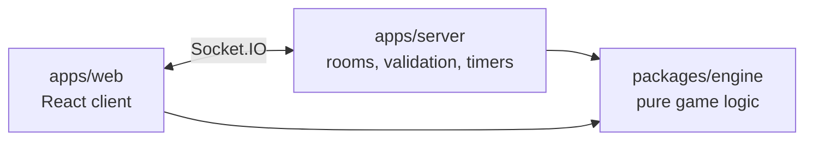

# Tayan

A real-time multiplayer bluffing card game for the browser, based on the rules of Bluff: players bid poker hands they believe exist among the pooled cards of everyone at the table. Create a room, share the link, play. No accounts, just a nickname. Available in Polish and English.

Polish version: [README.pl.md](README.pl.md). Full requirements: [docs/spec.md](docs/spec.md) (Polish).

## Run locally

Requires Node.js 22+ and pnpm.

```bash
pnpm install
pnpm dev
```

Open http://localhost:5173, create a room and invite others with the link. To try a game alone, add bots to your room (they are ordinary WebSocket clients):

```bash
pnpm dev:bots ROOMCODE 2
```

Other commands: `pnpm test`, `pnpm lint`, `pnpm typecheck`, `pnpm build`, `pnpm engine:deck-table`, `pnpm engine:cli`.

## How it works



- `packages/engine`: pure functions and no I/O; the same code validates moves on the server and lists legal declarations in the UI.
- `apps/server`: authoritative Node.js + Socket.IO server; every payload is validated with zod and each player only ever receives their own `PlayerView`, so other players' cards never reach the client before the reveal. See [docs/protocol.md](docs/protocol.md).
- `apps/web`: React + Vite + Tailwind client with PL/EN translations.

Design decisions are recorded in [docs/adr](docs/adr). Deployment (Cloudflare Pages + Render, both free) is described in [docs/deployment.md](docs/deployment.md), and the game rules are in the documentation site (`pnpm docs:dev`).
