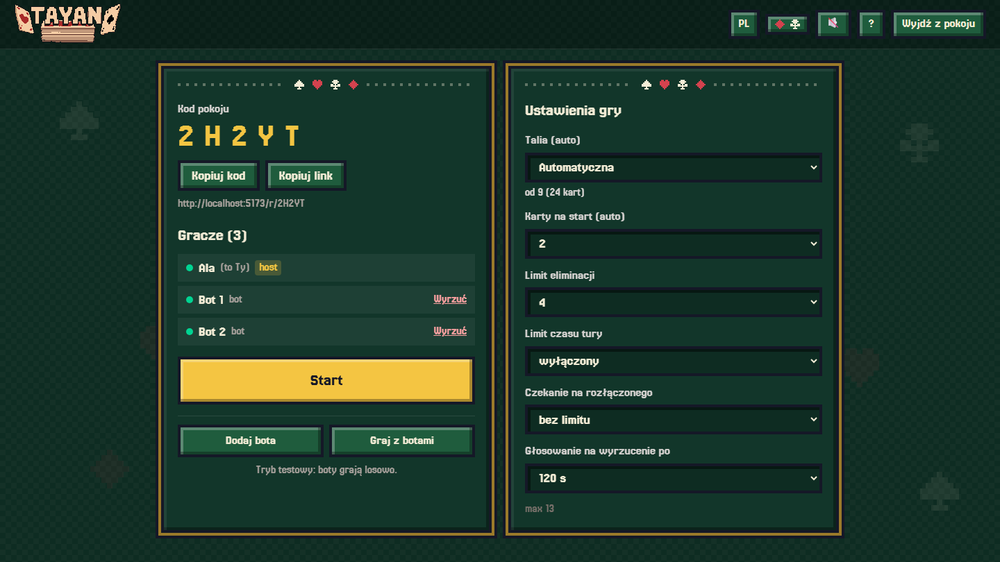
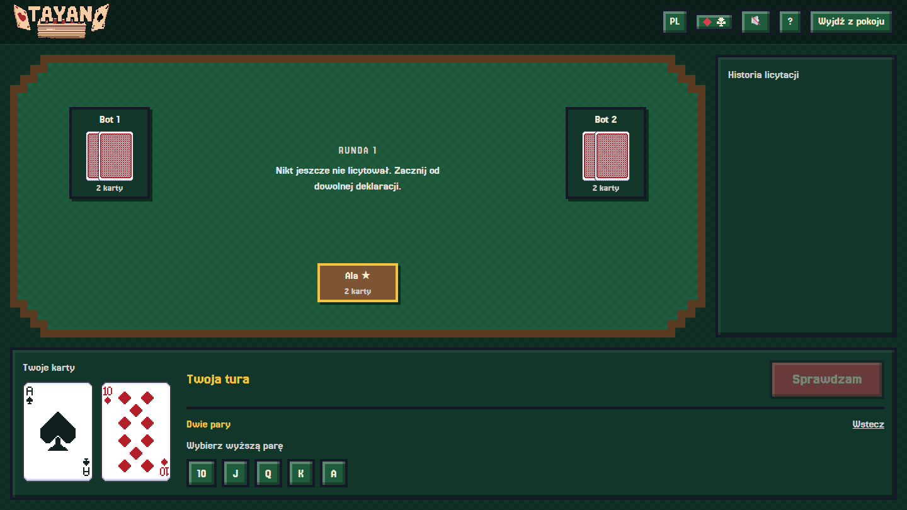
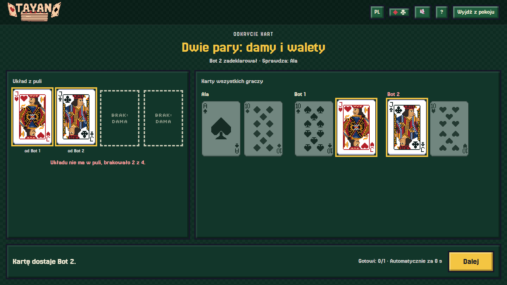

  

  <b>Blefuj, licytuj układy pokerowe i zdemaskuj przeciwników.</b> 
  Karciana gra dla 2–13 osób, prosto w przeglądarce. Bez kont, bez instalacji.

  <a href="https://tayan.pages.dev"><b>▶ Zagraj teraz</b></a>
  &nbsp;·&nbsp;
  <a href="README.md">English</a>

  

## O co chodzi

Każdy z graczy dostaje kilka kart, ale widzi tylko swoje. Nikt nie wie, co mają pozostali. W swojej kolejce **ogłaszasz układ pokerowy**, który Twoim zdaniem da się złożyć ze wszystkich kart na stole razem, albo **sprawdzasz** poprzednika. Masz parę dam w ręce? A może tylko udajesz? To już Twoja sprawa.

Rundy są krótkie, a napięcie rośnie z każdą kartą, którą przegrany dobiera. Ostatni gracz w grze wygrywa.

## Jak zacząć

1. Wejdź na **[tayan.pages.dev](https://tayan.pages.dev)**, wpisz nick i kliknij **Utwórz pokój**.
2. Wyślij znajomym **kod pokoju** albo link. Wystarczy, że go otworzą i wpiszą nick.
3. Gdy wszyscy są w pokoju, kliknij **Start**. Nie masz z kim grać? Dodaj **boty** w poczekalni i przetestuj zasady.

  

## Jak się gra

1. **Rozdanie.** Każdy dostaje na początku 2 karty (przy dużej liczbie graczy 1). Widzisz tylko swoje.
2. **Licytacja.** Pierwszy gracz ogłasza dowolny układ, np. „para dam". Kolejny musi zrobić jedno z dwóch:
   - **przebić**: ogłosić układ _wyższy_ od poprzedniego, albo
   - **sprawdzić**: uznać, że poprzednik blefuje.

   Pasowania nie ma. Jeśli ktoś ogłosi najwyższy możliwy układ, następny gracz może już tylko sprawdzać.

3. **Sprawdzenie.** Wszyscy odkrywają karty i patrzymy, czy ogłoszony układ da się złożyć **ze wszystkich kart wszystkich graczy razem**. Nie musi być w ręce ogłaszającego!
   - Układ **jest**: kartę dostaje ten, kto sprawdzał.
   - Układu **nie ma**: kartę dostaje ten, kto go ogłosił.
4. **Kolejna runda.** Przegrany ma o jedną kartę więcej, a karty są tasowane od nowa. Kto dobierze do limitu (domyślnie **6 kart**), odpada. Wygrywa ostatni gracz.

  

### Układy od najniższego

|     | Układ        | Przykład                             |
| --- | ------------ | ------------------------------------ |
| 1   | Wysoka karta | walet                                |
| 2   | Para         | dwie damy                            |
| 3   | Dwie pary    | króle i dziewiątki                   |
| 4   | Strit        | pięć kolejnych figur, np. 6-7-8-9-10 |
| 5   | Trójka       | trzy asy                             |
| 6   | Kolor        | pięć kart w kolorze pik              |
| 7   | Full         | trzy króle i dwie dziewiątki         |
| 8   | Kareta       | cztery walety                        |
| 9   | Poker        | strit w jednym kolorze               |

Uwaga: **strit jest niżej niż trójka**, inaczej niż w klasycznym pokerze, bo przy kartach wielu graczy strit trafia się dużo łatwiej. W grze możesz w każdej chwili zajrzeć do pomocy (przycisk **?** albo klawisz **H**).

### Odkrycie kart

Po sprawdzeniu widać dokładnie, skąd wziął się układ i czego zabrakło. Karty odwracają się po kolei i od razu widać, kto dostaje dodatkową kartę. To najlepszy moment na wnioski przed następną rundą.

  

## Kilka rad

- **Nie bój się blefować.** Deklaracja nie musi opierać się na Twoich kartach, liczy się cała pula.
- **Licz karty, których nie widzisz.** Im więcej kart w grze, tym łatwiej o parę, trójkę czy strit, więc wysokie układy ogłaszaj ostrożnie.
- **Obserwuj przeciwników.** Kto zawsze przebija, a kto sprawdza szybko? Zapamiętaj to na następną rundę.

## Ustawienia pokoju

Host w poczekalni może zmienić: liczbę kart na start, limit eliminacji, limit czasu na ruch, talię i czas na powrót rozłączonego gracza. Gracze, którzy stracili połączenie, wracają do gry po odświeżeniu strony z tymi samymi kartami. Jest też przełącznik **czterech kolorów** (karo i trefl w innych barwach) dla lepszej czytelności.

## Dla programistów

Uruchomienie lokalne, architektura i wdrożenie: [docs/development.pl.md](docs/development.pl.md). Pełna specyfikacja zasad: [docs/spec.md](docs/spec.md).

Grafika kart: [Pixel Art Playing Cards](https://kerenel.itch.io/pixelart-cards) autorstwa Kerenel (CC0). Więcej w [docs/assets.md](docs/assets.md).
