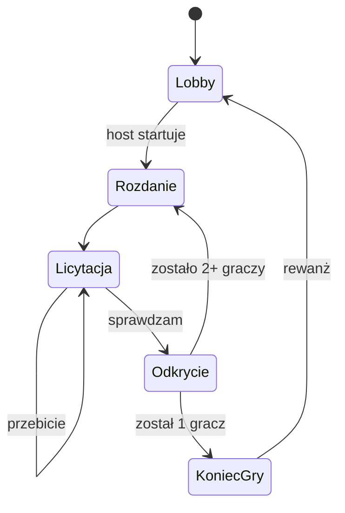

# Tayan: specyfikacja gry

Sep 24, 2026 · @Mateusz

## Cel i zakres

Tayan to przeglądarkowa gra karciana multiplayer w czasie rzeczywistym, oparta na zasadach Blefa: gracze licytują układy pokerowe, które ich zdaniem występują wśród kart wszystkich graczy. Gracz tworzy pokój, wysyła link znajomym i grają bez zakładania kont, podobnie jak na Kurniku.

**MVP (zakres tej specyfikacji):**

- Pokoje z kodem i linkiem zaproszenia, gra bez kont (sam nick)
- Pełna logika gry: rozdanie, licytacja, sprawdzenie, przyznawanie kart, odpadanie, zwycięzca
- Automatyczny dobór talii do liczby graczy, z możliwością nadpisania przez hosta
- Serwer autorytatywny: klient nigdy nie dostaje cudzych kart przed sprawdzeniem
- Reconnect po odświeżeniu strony lub utracie połączenia
- Interfejs na desktop (przeglądarka na komputerze); wersja na telefon po MVP
- Dwie wersje językowe: polska i angielska, przełączane w dowolnym momencie
- Pomoc dostępna w każdej chwili: zasady gry oraz ranking układów obowiązujący w bieżącej grze
- Darmowy hosting i publiczne repozytorium GitHub z dokumentacją gry

**Poza MVP (później):** wersja na telefon, bot AI, ranking układów liczony symulacją Monte Carlo, konta i statystyki, prosty czat tekstowy w pokoju (bez czatu głosowego).

**Wskazówki dla Claude Code:** realizuj kamienie milowe po kolei (sekcja Testy i kamienie milowe). Zacznij od czystego silnika gry z testami, zanim powstanie serwer i UI. Reguły opisane jako konfigurowalne implementuj jako ustawienia z podaną wartością domyślną, a przy niejasnościach pytaj zamiast zgadywać.

## Zasady gry

Każda runda kończy się sprawdzeniem, po którym dokładnie jeden gracz dostaje dodatkową kartę; gracz, który osiągnie 5 kart, odpada, a wygrywa ostatni gracz w grze.

**Przygotowanie**

- Liczba graczy: od 2 do 13 (górna granica wynika z talii, patrz Talia).
- Startowa liczba kart na gracza: 1 lub 2, ustawiana przez hosta. Domyślnie 2 przy maksymalnie 6 graczach, 1 przy 7 i więcej.
- Limit eliminacji: 5 kart (konfigurowalny, domyślnie 5). Gracz, który po przegranej rundzie ma tyle kart, odpada.
- Kolejność graczy przy stole jest losowana na starcie gry i stała przez całą grę.

**Przebieg rundy**

1. Serwer tasuje całą talię i rozdaje każdemu aktywnemu graczowi tyle kart, ile ma na swoim liczniku.
2. Gracz rozpoczynający składa pierwszą deklarację. Nie może sprawdzić, bo nie ma czego.
3. Kolejny gracz (zgodnie z kolejnością) musi wybrać jedno z dwóch:
   - **przebić**: zadeklarować układ ściśle wyższy od ostatniej deklaracji,
   - **sprawdzić**: zakwestionować ostatnią deklarację.
4. Pasowanie nie istnieje. Jeśli ostatnia deklaracja jest najwyższym możliwym układem, kolejny gracz ma do wyboru tylko sprawdzenie.
5. Po sprawdzeniu wszyscy pokazują karty. Serwer sprawdza, czy zadeklarowany układ występuje w puli wszystkich rozdanych kart.
   - Układ **występuje**: kartę dostaje sprawdzający.
   - Układ **nie występuje**: kartę dostaje deklarujący.
6. Przegrany rundy dostaje +1 do licznika kart. Jeśli licznik osiągnął limit, gracz odpada.
7. Jeśli został jeden gracz, jest zwycięzcą. W przeciwnym razie następna runda.

**Kto zaczyna rundę:** pierwszą rundę zaczyna pierwszy gracz z wylosowanej kolejności. Każdą następną zaczyna kolejny aktywny gracz po tym, który zaczynał poprzednią rundę (rotacja zgodnie z kolejnością przy stole), niezależnie od tego, kto przegrał. Gracze, którzy odpadli, są pomijani.

**Ważne:** układ liczy się w puli wszystkich kart wszystkich graczy, niezależnie od tego, czyje to karty. Deklaracja nie musi dotyczyć własnej ręki.



Faza Odkrycie trwa kilka sekund (domyślnie 6 s albo do kliknięcia "Dalej" przez wszystkich), żeby gracze zdążyli zobaczyć karty i wynik.

## Talia i automatyczny dobór talii

Talia zawsze kończy się na asie, a w trybie automatycznym jej najniższa figura to najwyższa figura, przy której w typowej grze kareta występuje w puli najwyżej w ok. 15% rund, a jakikolwiek poker najwyżej w ok. 10%.

**Uzasadnienie:** wzór "tyle figur, ilu graczy" gwarantował tylko, że kart wystarczy. Przy 6 graczach i talii od 9 w grze jest średnio ponad połowa talii, więc kareta występuje w ok. 49% rund, a poker w ok. 32%, i licytacja szybko ucieka w najwyższe układy. O trudności decyduje stosunek kart w grze do wielkości talii, dlatego talia musi rosnąć szybciej niż liczba graczy.

**Tabela referencyjna** (symulacja 300 gier na wariant, przegrany rundy losowany, 2 karty startowe do 6 graczy, 1 od 7, limit 5):

| Liczba graczy | Najniższa figura | Kart w talii | Śr. kart w grze | Kareta w puli (% rund) | Jakikolwiek poker (% rund) |
| --- | --- | --- | --- | --- | --- |
| 2 | 9 | 24 | 5,6 | 1 | 0 |
| 3 | 9 | 24 | 7,6 | 4 | 2 |
| 4 | 8 | 28 | 9,7 | 9 | 5 |
| 5 | 7 | 32 | 11,4 | 13 | 7 |
| 6 | 5 | 40 | 13,6 | 13 | 8 |
| 7 | 5 | 40 | 12,9 | 12 | 8 |
| 8 | 3 | 48 | 14,4 | 12 | 8 |
| 9 | 2 | 52 | 16,3 | 15 | 10 |
| 10 | 2 | 52 | 17,8 | 20 | 16 |
| 11 | 2 | 52 | 19,3 | 27 | 21 |
| 12 | 2 | 52 | 21,0 | 34 | 29 |
| 13 | 2 | 52 | 22,8 | 43 | 37 |

Od 10 graczy nawet pełna talia nie utrzymuje progów, więc lobby pokazuje ostrzeżenie i proponuje obniżenie limitu eliminacji do 4.

**Algorytm doboru (tryb automatyczny):**

1. Twarde ograniczenie: 4 × liczba graczy nie może przekroczyć liczby kart w talii.
2. Dla każdej dopuszczalnej najniższej figury (od 9 w dół) silnik symuluje ok. 1000 gier z bieżącymi ustawieniami (liczba graczy, karty startowe, limit) i liczy, w jakim odsetku rund kareta i poker występują w puli.
3. Wybiera najmniejszą talię, która mieści się w progach; jeśli żadna nie mieści się, pełną talię z ostrzeżeniem.
4. Progi (domyślnie 15% i 10%) są stałymi w konfiguracji, żeby dało się je dostroić po pierwszych grach.

Dla standardowych ustawień wynik jest liczony z góry skryptem pnpm engine:deck-table i zapisany w silniku jako tabela, więc serwer nic nie liczy; symulacja w locie (z mniejszą liczbą gier) tylko dla niestandardowych ustawień. Tabela powyżej służy jako wyrocznia w testach (wynik algorytmu musi się zgadzać z tolerancją jednej figury).

**Zasady implementacji:**

- Talia jest ustalana raz na starcie gry i nie zmienia się, gdy gracze odpadają (żeby lista możliwych deklaracji była stała przez całą grę).
- Host wybiera w lobby tryb talii: automatyczny (domyślny, według algorytmu powyżej), pełna talia (od 2, 52 karty) albo własna najniższa figura (dowolna od 2 do 9). UI blokuje wartości, przy których 4 × liczba graczy przekracza liczbę kart w talii.
- Kolory: ♣ trefl, ♦ karo, ♥ kier, ♠ pik. Kolejność kolorów (od najniższego) ma znaczenie tylko przy porównywaniu deklaracji koloru i pokera.
- Tasowanie: Fisher-Yates z kryptograficznym RNG na serwerze (`crypto.randomInt`). Silnik przyjmuje RNG jako parametr, żeby testy były deterministyczne.

## Układy, parametry deklaracji i kolejność

Każda deklaracja to konkretny układ z pełnymi parametrami (np. "full na damach z dziewiątkami", nie samo "full"), a wszystkie możliwe deklaracje tworzą jedną uporządkowaną listę, w której przebicie oznacza wyższy indeks.

**Kategorie (od najniższej, domyślna kolejność):**

| # | Kategoria | Parametry | Warunek wystąpienia w puli |
| --- | --- | --- | --- |
| 1 | Wysoka karta | figura r | co najmniej 1 karta figury r |
| 2 | Para | figura r | co najmniej 2 karty figury r |
| 3 | Dwie pary | figury a > b | co najmniej 2 karty a i 2 karty b |
| 4 | Strit | najwyższa figura t | co najmniej po 1 karcie każdej z figur t-4..t |
| 5 | Trójka | figura r | co najmniej 3 karty figury r |
| 6 | Kolor | tylko kolor s (bez figury) | co najmniej 5 kart koloru s |
| 7 | Full | trójka a, para b, a ≠ b | co najmniej 3 karty a i 2 karty b |
| 8 | Kareta | figura r | 4 karty figury r |
| 9 | Poker | kolor s, najwyższa figura t | karty koloru s o figurach t-4..t |

Strit jest poniżej trójki (odwrotnie niż w klasycznym pokerze), bo przy puli kart wielu graczy strit występuje łatwiej.

**Porównywanie deklaracji:** najpierw kategoria, potem parametr główny, potem poboczny. Dwie pary: najpierw wyższa para, potem niższa. Full: najpierw figura trójki, potem pary. Kolor: kolejność kolorów ♣ < ♦ < ♥ < ♠. Poker: najpierw najwyższa figura, potem kolor. Najwyższą możliwą deklaracją jest poker do asa w piku.

**Strit:** układ pięciu kolejnych figur w obrębie talii. W talii od 9 są dwa strity (9-K i 10-A), w pełnej talii dziewięć (6-10 ... 10-A). As jest zawsze najwyższą kartą, strit A-2-3-4-5 nie istnieje.

**Wymagania dla silnika:**

- `generateDeclarations(deckConfig)` zwraca pełną, posortowaną listę deklaracji dla danej talii; każda ma stabilne `id` (np. `FULL:Q:9`, `STRAIGHT:A`, `FLUSH:H`) i `rank` (indeks na liście).
- `isHigher(a, b)` to porównanie indeksów.
- `existsInPool(declaration, cards)` liczy wystąpienia figur i kolorów w puli i sprawdza warunek z tabeli. Dla pokera sprawdza konkretne karty.
- `matchDeclaration(declaration, cards)` zwraca najlepsze dopasowanie deklaracji do puli: znalezione karty oraz brakujące miejsca (np. dla fulla damy na dziewiątkach: dwie damy i dwie dziewiątki znalezione, brakuje jednej damy). Działa także, gdy układu nie ma, żeby przy odkryciu było widać, ile brakowało.
- Deklaracja fizycznie niemożliwa w bieżącej puli (np. full przy 3 kartach w grze) jest dozwolona; po sprawdzeniu po prostu przegrywa.

**Konfigurowalna kolejność:** kolejność kategorii jest przechowywana jako tablica w ustawieniach gry, a nie zaszyta w kodzie. W talii od 9 kolor jest trudniejszy niż full, w pełnej talii przy dużej puli łatwiejszy, dlatego później można dodać tryb, w którym kolejność wyznacza symulacja prawdopodobieństw.

## Architektura techniczna i stack

Monorepo w TypeScript z trzema pakietami: czysty silnik gry współdzielony przez serwer i klienta, serwer Node.js z Socket.IO jako jedyne źródło prawdy oraz klient React.

```
tayan/
  packages/engine/   # czysta logika gry, zero I/O, 100% testowalna
  apps/server/       # Node.js + Socket.IO, pokoje w pamięci
  apps/web/          # React + Vite + Tailwind
```

| Warstwa | Technologia | Uzasadnienie |
| --- | --- | --- |
| Monorepo | pnpm workspaces | jeden `pnpm install`, współdzielone typy |
| Silnik | TypeScript, bez zależności | ten sam kod waliduje ruchy na serwerze i podpowiada dozwolone deklaracje w UI |
| Serwer | Node.js 22, Socket.IO 4 | wbudowane pokoje, reconnect, fallback transportu |
| Walidacja wiadomości | zod | każde zdarzenie od klienta jest parsowane przed użyciem |
| Klient | React 19, Vite, Tailwind | szybki start, dobry DX |
| Stan klienta | Zustand | prosty store zasilany zdarzeniami z serwera |
| Testy | Vitest, fast-check, Playwright | jednostkowe, property-based, e2e |

**Zasady architektoniczne:**

- **Serwer autorytatywny.** Klient wysyła tylko intencje ("deklaruj X", "sprawdzam"). Serwer waliduje, zmienia stan i rozsyła widoki.
- **Widoki per gracz.** Serwer nigdy nie wysyła pełnego stanu. Każdy gracz dostaje własne karty i liczniki kart pozostałych. Pełne ręce trafiają do wszystkich dopiero w fazie Odkrycie.
- **Silnik jako czyste funkcje:** `applyAction(state, action) -> { state, events }`. Serwer to cienka warstwa: odbiera zdarzenie, woła silnik, rozsyła wynik.
- **Stan w pamięci** (mapa `roomCode -> Room`). Brak bazy danych w MVP. Restart serwera kończy trwające gry, co jest akceptowalne na tym etapie.
- **Jeden proces** serwera obsługuje tylko WebSocket; statyczny klient jest hostowany osobno (patrz Darmowy hosting), a lokalnie oba startują jedną komendą pnpm dev.

## Model danych i stan gry

Stan dzieli się na pokój (kto jest w środku i jakie są ustawienia) oraz grę (karty, licytacja, liczniki); klient dostaje wyłącznie `PlayerView`, nigdy `GameState`.

```ts
type Suit = 'C' | 'D' | 'H' | 'S';          // trefl, karo, kier, pik
type Rank = 2|3|4|5|6|7|8|9|10|11|12|13|14; // 11=J ... 14=A
type Card = { rank: Rank; suit: Suit };

type Category =
  'HIGH' | 'PAIR' | 'TWO_PAIR' | 'THREE' | 'STRAIGHT' |
  'FLUSH' | 'FULL' | 'FOUR' | 'STRAIGHT_FLUSH';

type Declaration = {
  id: string;            // np. 'FULL:12:9', 'FLUSH:H', 'STRAIGHT_FLUSH:14:S'
  category: Category;
  ranks: Rank[];         // parametry figur w kolejności ważności
  suit?: Suit;
  order: number;         // indeks na posortowanej liście
};

type GameSettings = {
  deckMode: 'AUTO' | 'FULL' | 'CUSTOM'; // wybór hosta, domyślnie AUTO
  lowestRank: Rank;          // AUTO: z tabeli doboru talii, FULL: 2, CUSTOM: wybrana przez hosta
  startingCards: 1 | 2;
  eliminationLimit: number;  // domyślnie 5
  categoryOrder: Category[];
  turnTimerSec: number | null; // null = bez limitu
  inactiveTimeoutSec: number | null; // null = czekamy bez końca (domyślnie)
  kickVoteAfterSec: number;  // domyślnie 120
};

type PlayerId = string;

type GameState = {
  settings: GameSettings;
  declarations: Declaration[];          // wygenerowane raz na grę
  seating: PlayerId[];                  // stała kolejność
  cardCounts: Record<PlayerId, number>; // licznik kart do rozdania
  eliminated: PlayerId[];               // w kolejności odpadania
  round: {
    number: number;
    hands: Record<PlayerId, Card[]>;    // TYLKO na serwerze
    starter: PlayerId;
    currentTurn: PlayerId;
    bids: { playerId: PlayerId; declarationId: string; at: number }[];
    phase: 'BIDDING' | 'REVEAL';
    result?: RoundResult;
  };
  winner?: PlayerId;
};

type RoundResult = {
  checkerId: PlayerId;
  declarerId: PlayerId;
  declarationId: string;
  existed: boolean;
  matchedCards: { card: Card; ownerId: PlayerId }[]; // najlepsze dopasowanie, także niepełne
  missingSlots: { rank?: Rank; suit?: Suit }[];      // czego zabrakło (puste, gdy existed)
  loserId: PlayerId;
  loserEliminated: boolean;
  allHands: Record<PlayerId, Card[]>;
};

type PlayerView = {
  me: PlayerId;
  myCards: Card[];
  players: { id: PlayerId; nick: string; cardCount: number; eliminated: boolean; connected: boolean }[];
  currentTurn: PlayerId;
  bids: GameState['round']['bids'];
  allowedDeclarationMinOrder: number; // UI pokazuje tylko wyższe
  canCheck: boolean;
  phase: 'BIDDING' | 'REVEAL' | 'GAME_OVER';
  lastResult?: RoundResult;           // tylko w REVEAL i GAME_OVER
  turnDeadline?: number;              // timestamp ms
};
```

Funkcja `toPlayerView(state, playerId)` w silniku jest jedynym miejscem, które decyduje, co widzi gracz. Test musi potwierdzać, że w fazie BIDDING widok nie zawiera cudzych kart.

## Protokół WebSocket: zdarzenia klient/serwer

Klient wysyła tylko intencje z potwierdzeniem (ack), a serwer po każdej zmianie rozsyła każdemu graczowi jego własny, pełny widok zamiast różnic, co upraszcza reconnect i eliminuje rozjazdy stanu.

**Klient → serwer** (każde z callbackiem `ack({ ok: true } | { ok: false, error })`):

| Zdarzenie | Payload | Kto może |
| --- | --- | --- |
| `room:create` | `{ nick }` | każdy |
| `room:join` | `{ code, nick, sessionToken? }` | każdy |
| `room:leave` | `{}` | członek pokoju |
| `room:settings` | `Partial<GameSettings>` | host, tylko w lobby |
| `room:kick` | `{ playerId }` | host |
| `game:start` | `{}` | host, min. 2 graczy |
| `game:declare` | `{ declarationId }` | gracz, którego jest tura |
| `game:check` | `{}` | gracz, którego jest tura, gdy istnieje deklaracja |
| `game:ready` | `{}` | gracz w fazie REVEAL ("Dalej") |
| `game:rematch` | `{}` | host po zakończeniu gry |

**Serwer → klient:**

| Zdarzenie | Payload | Kiedy |
| --- | --- | --- |
| `session` | `{ playerId, sessionToken, roomCode }` | po create/join, klient zapisuje w localStorage |
| `room:state` | lista graczy, host, ustawienia, faza pokoju | po każdej zmianie w pokoju |
| `game:view` | `PlayerView` | po każdej zmianie stanu gry, osobno dla każdego gracza |
| `game:event` | `{ type, ... }` | krótkie komunikaty do animacji i logów (np. "Ania: sprawdzam") |
| `error` | `{ code, message }` | błędy niezwiązane z konkretnym ack |

**Kody błędów:** `ROOM_NOT_FOUND`, `ROOM_FULL`, `GAME_IN_PROGRESS`, `NOT_YOUR_TURN`, `BID_TOO_LOW`, `NOTHING_TO_CHECK`, `NOT_HOST`, `INVALID_PAYLOAD`, `NICK_TAKEN`.

**Walidacja:** każdy payload przechodzi przez schemat zod. Serwer ignoruje stan przysłany przez klienta i opiera się wyłącznie na własnym. Prosty rate limit: maks. 10 zdarzeń na sekundę na połączenie.

## Pokoje, lobby, reconnect

Pokój identyfikuje 5-znakowy kod, dołącza się linkiem `/r/KOD`, a tożsamość gracza trzyma `sessionToken` w localStorage, dzięki czemu odświeżenie strony nie wyrzuca z gry.

**Pokoje:**

- Kod: 5 znaków z alfabetu bez mylących się znaków (bez 0/O, 1/I/L), np. `K7XQM`.
- Twórca pokoju zostaje hostem. Gdy host wyjdzie, host przechodzi na najdłużej obecnego gracza.
- Maksymalnie 13 graczy. Nick: 1 do 16 znaków, unikalny w pokoju.
- Dołączenie w trakcie gry: nowa osoba trafia do poczekalni jako widz i wchodzi do gry przy rewanżu. Widz widzi tylko publiczne informacje (liczniki kart, licytację, odkrycia).
- Pusty pokój jest usuwany po 10 minutach.

**Lobby:** host widzi ustawienia z wartościami domyślnymi wyliczonymi dla aktualnej liczby graczy (najniższa figura, karty startowe). Wartości automatyczne przeliczają się na żywo przy dołączaniu graczy, dopóki host ich ręcznie nie nadpisze.

**Reconnect:**

1. Przy pierwszym wejściu serwer nadaje `playerId` i `sessionToken` (losowy, 128 bitów).
2. Klient zapisuje je w localStorage razem z kodem pokoju.
3. Po ponownym połączeniu klient wysyła `room:join` z tokenem. Serwer podpina nowy socket do istniejącego gracza i od razu wysyła `game:view`.
4. Rozłączony gracz jest oznaczony w UI jako offline, ale zostaje w grze.

**Rozłączony gracz w swojej turze:** gra domyślnie czeka na niego bez limitu. Host może w lobby ustawić limit oczekiwania (np. 2, 5 lub 10 min), po którego upływie gracz odpada tak, jakby przegrał. Niezależnie od limitu, po 2 min nieaktywności gracza w jego turze (wartość konfigurowalna) pozostali gracze mogą zagłosować za jego wyrzuceniem; przy większości głosów aktywnych graczy odpada tak, jakby przegrał, a gra toczy się dalej. Opcjonalny timer tury dla podłączonych graczy działa osobno: po upływie czasu serwer wykonuje automatyczne "sprawdzam" albo najniższą możliwą deklarację, gdy gracz zaczyna rundę.

## UI/UX: ekrany

Aplikacja ma pięć ekranów, projektowanych pod desktop (od 1024 px szerokości), z układem opartym na flexbox/grid, który później da się dostosować do telefonu, a najważniejszym elementem jest wybór deklaracji, który pozwala wybrać tylko układy wyższe od bieżącego.

| Ekran | Zawartość |
| --- | --- |
| Start | logo Tayan, pole nick, przyciski "Utwórz pokój" i "Dołącz" (pole na kod) |
| Lobby | kod pokoju, przycisk "Kopiuj link", lista graczy (host oznaczony), ustawienia (edytowalne tylko dla hosta), "Start" |
| Stół | gracze wokół stołu z licznikiem kart i statusem, moje karty na dole, historia licytacji, panel akcji |
| Odkrycie | karty wszystkich graczy oraz zadeklarowany układ ułożony z kart z puli (z oznaczeniem, kto je miał), a brakujące karty jako puste miejsca, np. "brakowało 1 z 5"; komunikat kto dostaje kartę, przycisk "Dalej" |
| Koniec gry | zwycięzca, kolejność odpadania, przycisk "Rewanż" (host) |

**Panel akcji na stole:**

- Duży przycisk **Sprawdzam**, aktywny tylko w mojej turze i gdy jest już deklaracja.
- Wybór deklaracji w dwóch krokach: najpierw kategoria (niedostępne kategorie wyszarzone), potem parametry (figury, kolor). Przycisk potwierdzenia pokazuje pełną nazwę, np. "Full: damy na dziewiątkach".
- Skrót "Minimalne przebicie" deklaruje najniższy dozwolony układ.
- Ostatnia deklaracja jest zawsze widoczna dużym tekstem na środku stołu.

**Czytelność:**

- Nazwy układów po polsku, generowane z jednej funkcji `formatDeclaration(decl, 'pl')`, obsługującej języki pl i en.
- Karty rysowane w SVG/CSS (bez zewnętrznych grafik), kolory czerwony i czarny, czytelne także w mniejszym oknie przeglądarki.
- Wyraźny wskaźnik czyja tura i odliczanie, jeśli timer jest włączony.
- Dyskretny dźwięk i migający tytuł karty przeglądarki, gdy zaczyna się moja tura. Możliwość wyciszenia.

**Pomoc zawsze pod ręką:** przycisk "?" (oraz skrót klawiszowy H) jest widoczny na każdym ekranie i otwiera panel boczny, który nie przerywa gry ani nie zasłania panelu akcji. Panel ma trzy zakładki:

- **Układy w tej grze:** lista kategorii w kolejności obowiązującej w bieżącej grze, od najniższej do najwyższej, z przykładem kart dla każdej (np. strit do damy w bieżącej talii) i informacją, jakie parametry się podaje. Generowana z `settings.categoryOrder` i talii, nie z tekstu na sztywno, więc zawsze zgadza się z ustawieniami pokoju.
- **Ustawienia tej gry:** talia (od jakiej figury, ile kart), karty startowe, limit eliminacji, timer.
- **Zasady:** krótka instrukcja w 5 do 7 punktach, z odnośnikiem do pełnych zasad w dokumentacji.

Przy pierwszej wizycie gracz widzi jednorazowo krótki samouczek (3 karty z wyjaśnieniem: deklaruj, przebijaj, sprawdzaj), możliwy do pominięcia.

**Wersje językowe (PL i EN):**

- Biblioteka `react-i18next`; teksty w `apps/web/src/i18n/{pl,en}.json`, bez tekstów wpisanych na sztywno w komponentach.
- Język domyślny wykrywany z przeglądarki, przełącznik PL/EN w nagłówku, wybór zapisywany w localStorage. Każdy gracz w pokoju może mieć inny język.
- Serwer nie wysyła tekstów dla ludzi, tylko kody (błędów, zdarzeń, deklaracji), a klient tłumaczy je lokalnie.
- Nazwy układów: wysoka karta / high card, para / pair, dwie pary / two pair, trójka / three of a kind, strit / straight, kolor / flush, full / full house, kareta / four of a kind, poker / straight flush.
- Test w CI sprawdza, że oba pliki językowe mają identyczny zestaw kluczy.
- Zasady gry w dokumentacji repozytorium również w dwóch językach.

## Repozytorium, dokumentacja i praca z Claude Code

Publiczne repozytorium `tayan` na GitHubie (licencja MIT) zawiera kod, tę specyfikację, dokumentację gry publikowaną jako strona na GitHub Pages oraz plik `CLAUDE.md`, który daje Claude Code stały kontekst w każdej sesji.

```
tayan/
  CLAUDE.md                # kontekst i zasady dla Claude Code
  README.md                # EN, z linkiem do README.pl.md
  README.pl.md
  LICENSE                  # MIT
  CHANGELOG.md
  docs/
    spec.md                # ta specyfikacja (eksport z tego dokumentu)
    architecture.md        # diagramy, przepływ danych
    protocol.md            # zdarzenia WebSocket, generowane z schematów zod
    adr/                   # decyzje architektoniczne (0001-server-authoritative.md ...)
    site/                  # VitePress: zasady PL/EN, ranking układów, FAQ
  packages/engine/
  apps/server/
  apps/web/
  .github/
    workflows/ci.yml       # lint, typecheck, testy, build
    workflows/e2e.yml      # Playwright na PR
    workflows/docs.yml     # deploy strony dokumentacji na GitHub Pages
    workflows/deploy.yml   # deploy gry po merge do main
    ISSUE_TEMPLATE/
    pull_request_template.md
```

**Plik CLAUDE.md powinien zawierać:**

- Jednoakapitowy opis projektu i odnośnik do `docs/spec.md` jako źródła prawdy.
- Komendy: `pnpm dev`, `pnpm test`, `pnpm lint`, `pnpm typecheck`, `pnpm e2e`, `pnpm build`.
- Zasady nienaruszalne: silnik bez I/O i bez zależności; klient nigdy nie dostaje cudzych kart przed odkryciem; każdy payload przez zod; brak tekstów UI poza plikami i18n.
- Konwencje: kod, komentarze i commity po angielsku; Conventional Commits; TypeScript w trybie `strict`.
- Definition of Done dla każdej zmiany: testy, lint i typecheck zielone, zaktualizowana dokumentacja, jeśli zmieniło się zachowanie.

**Sposób pracy z Claude Code:**

1. Jeden kamień milowy to jedna gałąź i jeden PR, podzielony na małe commity.
2. Na początku każdego kamienia milowego Claude Code najpierw przedstawia plan (plan mode), a implementuje po Twojej akceptacji.
3. Testy silnika pisane przed implementacją lub razem z nią, z tabelą referencyjną talii jako wyrocznią.
4. Niejasności w specyfikacji kończą się pytaniem albo wpisem do `docs/adr/`, a nie cichą decyzją w kodzie.

**Jakość i utrzymanie:**

- ESLint (typescript-eslint) i Prettier, pre-commit przez husky i lint-staged.
- Ochrona gałęzi `main`: merge tylko przez PR z zielonym CI. Próg pokrycia testami silnika: 90%.
- Renovate lub Dependabot do aktualizacji zależności.
- GitHub Milestones M1 do M5 odpowiadają kamieniom milowym z tej specyfikacji; zadania jako Issues.
- Serwer: logi strukturalne (pino), endpoint `/healthz`, obsługa `SIGTERM` z powiadomieniem graczy.

**README** zawiera: GIF z rozgrywki, link do działającej gry, link do dokumentacji, diagram architektury (Mermaid), instrukcję uruchomienia lokalnego w 3 komendach i sekcję o decyzjach technicznych. To zarazem wizytówka projektu.

## Darmowy hosting

Klient i dokumentacja idą na darmowy hosting statyczny, a serwer WebSocket na darmową instancję Koyeb we Frankfurcie; całość kosztuje 0 zł za cenę zimnego startu serwera po okresie bezczynności.

| Element | Gdzie | Ograniczenia darmowego planu |
| --- | --- | --- |
| Klient (React, build statyczny) | Cloudflare Pages lub GitHub Pages | praktycznie brak dla tej skali |
| Dokumentacja (VitePress) | GitHub Pages | brak dla publicznego repo |
| Serwer WebSocket (kontener Docker) | [Koyeb](https://www.srvrlss.io/provider/koyeb/), instancja Free, region Frankfurt | 1 usługa, 512 MB RAM, 0,1 vCPU, uśpienie po 1 h bez ruchu |
| Alternatywa dla serwera | [Render](https://render.com/articles/platforms-with-a-real-free-tier-for-developers-in-2026), Free web service | uśpienie po 15 min bez ruchu, start ok. 1 min, 750 h/mies. |

Fly.io i Railway nie wchodzą w grę: oba działają już tylko w modelu trial lub płatności za zużycie ([porównanie](https://hatchable.com/articles/state-of-free-web-hosting-in-2026)).

**Konsekwencje dla projektu:**

- Klient ładuje się natychmiast ze statycznego hostingu, a jeśli serwer śpi, pokazuje ekran "Budzę serwer..." i próbuje połączenia aż do skutku. Dlatego klient i serwer są hostowane osobno, a serwer ma skonfigurowany CORS tylko dla domeny klienta.
- Uśpienie kasuje stan w pamięci, ale następuje dopiero po godzinie bez żadnego ruchu, czyli gdy nikt nie gra. Klient wysyła heartbeat co 25 s, więc trwająca gra (nawet w lobby) nie usypia serwera.
- 0,1 vCPU nie uduźiłoby symulacji talii przy każdej zmianie w lobby, dlatego tabela doboru talii jest liczona z góry skryptem i zapisana w silniku.
- Adres serwera i dozwolona domena klienta są zmiennymi środowiskowymi (`SERVER_URL`, `CLIENT_ORIGIN`), bez adresów wpisanych w kod.
- Deploy: GitHub Actions buduje obraz po merge do `main`, Koyeb i Cloudflare Pages wdrażają automatycznie z repozytorium.

## Testy i kamienie milowe

Silnik powstaje pierwszy i ma największe pokrycie testami, bo błąd w ocenie układu psuje całą grę.

**Testy:**

- Silnik (Vitest): `existsInPool` dla każdej kategorii z przypadkami granicznymi (full z trójką i parą tej samej figury, strit przy brakującej środkowej karcie, poker wymagający konkretnego koloru), kolejność deklaracji, dobór talii (zgodność z tabelą referencyjną), eliminacja i wybór rozpoczynającego.
- Property-based (fast-check): lista deklaracji jest ściśle rosnąca; monotoniczność (jeśli w puli jest trójka figury r, to jest też para r; jeśli full a/b, to też trójka a i dwie pary); suma kart w rękach równa się sumie liczników; `toPlayerView` w fazie BIDDING nie zawiera cudzych kart.
- Symulacja: 10 000 losowych gier z graczami wykonującymi losowe legalne ruchy, każda musi się zakończyć jednym zwycięzcą bez wyjątku.
- Serwer: testy integracyjne z kilkoma klientami `socket.io-client` (tworzenie pokoju, dołączanie, pełna runda, reconnect).
- E2E (Playwright): trzy konteksty przeglądarki grają jedną pełną grę.

**Kamienie milowe:**

1. **M1 Silnik:** typy, talia, generowanie i porównywanie deklaracji, `existsInPool`, `applyAction`, `toPlayerView`, komplet testów. Plus prosty CLI do gry lokalnej w terminalu jako szybka weryfikacja.
2. **M2 Serwer:** pokoje, protokół, walidacja, reconnect, timer, testy integracyjne.
3. **M3 Klient:** pięć ekranów, wybór deklaracji, ekran odkrycia z niepełnym układem, proste przejścia CSS zamiast animacji.
4. **M4 Deployment:** Docker, CI, publiczny adres, test z prawdziwymi znajomymi.
5. **M5 Po MVP:** dopracowane animacje i efekty (rozdawanie, odkrycie kart, przyznanie karty, eliminacja), wersja na telefon (responsywny układ, obsługa dotyku, wibracja przy turze), integracja bota z osobnego repozytorium badawczego (patrz sekcja Bot i badania), statystyki graczy.

   |  |  |  |
   | --- | --- | --- |
   |  |  |  |
   |  |  |  |

## Bot i badania

Bot i matematyczna optymalizacja gry powstają w osobnym repozytorium `tayan-lab` (Python), a repozytorium gry dostarcza tylko interfejs bota, eksport zasad w postaci testów i miejsce na gotowy, wytrenowany model.

**Dlaczego osobno:**

- Inny stack: Python, numpy, PyTorch, notebooki, zamiast TypeScript.
- Inny cykl życia: eksperymenty i wyniki badawcze kontra stabilny produkt z CI i deployem. Eksperymenty nie powinny zaszumiać historii gry ani spowalniać jej CI.
- Osobny projekt z własnym README, wynikami i wykresami jest czytelniejszy jako samodzielna praca ML.

**Co zostaje w repozytorium gry:**

- Interfejs `Bot { decide(view: PlayerView): Action }`. Bot widzi dokładnie to samo co człowiek (`PlayerView`), więc nie może oszukiwać.
- Prosty bot heurystyczny w TypeScript (np. przebija minimalnie, sprawdza, gdy szacowane prawdopodobieństwo układu spada poniżej progu), żeby dało się grać w niepełnym składzie już w MVP+.
- Komenda `pnpm engine:export-fixtures`, która zapisuje tysiące przypadków testowych (pula kart, deklaracja, czy występuje; kolejność deklaracji) do JSON. `tayan-lab` używa ich, żeby udowodnić, że jego implementacja zasad w Pythonie jest zgodna z silnikiem.
- Symulacja doboru talii, bo jej wynik jest częścią zasad gry.

**Co robi tayan-lab:**

1. Implementacja zasad w Pythonie, zweryfikowana fixture'ami z silnika, i szybki symulator.
2. Analiza balansu: prawdopodobieństwa układów dla talii i liczby kart, kolejność kategorii wynikająca z prawdopodobieństw, walidacja tabeli doboru talii.
3. Boty o rosnącej sile: heurystyka, wnioskowanie bayesowskie o kartach przeciwników na podstawie ich deklaracji (Monte Carlo po możliwych rękach), na końcu self-play z uczeniem ze wzmocnieniem.
4. Turniej botów (ranking Elo) jako miara postępu.

**Integracja z grą (do wyboru później):**

- Parametry bota eksportowane do JSON i odczytywane przez bota w TypeScript: najlżejsze, działa na darmowym serwerze.
- Model wyeksportowany do ONNX i uruchamiany na serwerze: mocniejszy bot, ale trzeba sprawdzić, czy 0,1 vCPU wystarczy.
- Bot jako zwykły klient WebSocket dołączający do pokoju przez ten sam protokół co ludzie: zero sprzężenia z serwerem, idealne do testów i turniejów, ale wymaga osobnego hostingu.

## Źródła

- [Blef (gra), Wikipedia](<https://pl.wikipedia.org/wiki/Blef_(gra)>)
- [Koyeb Free Tier 2026, srvrlss.io](https://www.srvrlss.io/provider/koyeb/)
- [Platforms with a real free tier for developers in 2026, Render](https://render.com/articles/platforms-with-a-real-free-tier-for-developers-in-2026)
- [State of free web hosting in 2026, Hatchable](https://hatchable.com/articles/state-of-free-web-hosting-in-2026)
